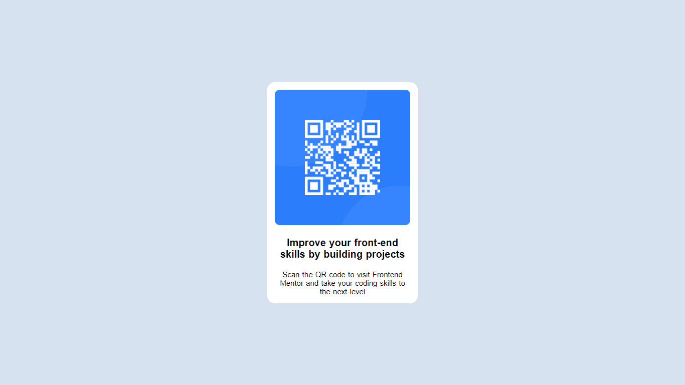

# Frontend Mentor - QR code component solution

This is a solution to the [QR code component challenge on Frontend Mentor](https://www.frontendmentor.io/challenges/qr-code-component-iux_sIO_H). Frontend Mentor challenges help you improve your coding skills by building realistic projects. 

## Table of contents

- [Overview](#overview)
  - [Screenshot](#screenshot)
  - [Links](#links)
- [My process](#my-process)
  - [Built with](#built-with)
  - [What I learned](#what-i-learned)
  - [Continued development](#continued-development)
  - [Useful resources](#useful-resources)
- [Author](#author)
- [Acknowledgments](#acknowledgments)

**Note: Delete this note and update the table of contents based on what sections you keep.**

## Overview

### Screenshot

Add a screenshot of your solution. The easiest way to do this is to use Firefox to view your project, right-click the page and select "Take a Screenshot". You can choose either a full-height screenshot or a cropped one based on how long the page is. If it's very long, it might be best to crop it.

Alternatively, you can use a tool like [FireShot](https://getfireshot.com/) to take the screenshot. FireShot has a free option, so you don't need to purchase it. 

Then crop/optimize/edit your image however you like, add it to your project, and update the file path in the image above.

**Note: Delete this note and the paragraphs above when you add your screenshot. If you prefer not to add a screenshot, feel free to remove this entire section.**

### Links

- Solution URL: [Add solution URL here](https://your-solution-url.com)
- Live Site URL: [Add live site URL here](https://your-live-site-url.com)

## My process

### Built with

- Semantic HTML5 markup
- CSS custom properties
- Flexbox

**Note: These are just examples. Delete this note and replace the list above with your own choices**

### What I learned

it took 1 hour for me to complete this project.

to be honest building this project easy for me. But i was confused at flexbox and making webpage responsive stuff like that.

but i gained some experience.
to be honest i felt like i did something good.

To see how you can add code snippets, see below:

<!DOCTYPE html>
<html lang="en">
<head>
  <meta charset="UTF-8">
  <meta name="viewport" content="width=device-width, initial-scale=1.0"> <!-- displays site properly based on user's device -->

  <link rel="icon" type="image/png" sizes="32x32" href="./images/favicon-32x32.png">
  
  <title>Frontend Mentor | QR code component</title>

  <!-- Feel free to remove these styles or customise in your own stylesheet 👍 -->
  
  <link rel="preconnect" href="https://fonts.googleapis.com">
  <link rel="stylesheet" href="style.css">
</head>
<body>
  

  

    

        
    

    

        
Improve your front-end skills by building projects

    

    

        
Scan the QR code to visit Frontend Mentor and take your coding skills to the next level

    

</body>
</html>

CSS :

body {
    margin: 0;
    height: 100vh;
    max-width: 1440px;
    min-width: 375px;
}

.container .qr-image img{
    width: 270px;
    border-radius: 10px;
}

.qr-code-component {
    background-color: hsl(212, 45%, 89%);
    display: flex;
    flex-direction: column;
    justify-content: center;
    height: 100vh;
    align-items: center;
    box-shadow: 0px 8px 8px hsl(212, 45%, 89%);
}

.container {
    display: flex;
    flex-wrap: wrap;
    width:min-content;
    flex-wrap: wrap;
    justify-content: center;
    flex-direction: column;
    align-items: center;
    background:hsl(0, 0%, 100%);
    padding: 15px;
    border-radius: 15px;
}

.container .title-content p {
    font-size: 20px;
    font-weight: 700;
    font-family: 'Open Sans', sans-serif;
    word-spacing: 1px;
    text-align:center;
}

.container .main-content p {
    margin: 0;
    font-size: 15px;
    word-spacing: 1px;
    font-weight: 400;
    text-align: center;
    font-family: 'Open Sans', sans-serif;
}

**Note: Delete this note and the content within this section and replace with your own learnings.**

### Continued development

**Note: Delete this note and the content within this section and replace with your own plans for continued development.**

### Useful resources

i did it on my own 

**Note: Delete this note and replace the list above with resources that helped you during the challenge. These could come in handy for anyone viewing your solution or for yourself when you look back on this project in the future.**

## Author

- Frontend Mentor - [@Nandhu125](https://www.frontendmentor.io/profile/Nandhu125)
- Twitter - [@starX125](https://www.twitter.com/starX125)

**Note: Delete this note and add/remove/edit lines above based on what links you'd like to share.**

## Acknowledgments
All thanks to Youtube.

To be honest i worked alone 
i have learning html, css from 2 months so i didn't needed any help 
i completed this project peacefully

**Note: Delete this note and edit this section's content as necessary. If you completed this challenge by yourself, feel free to delete this section entirely.**
